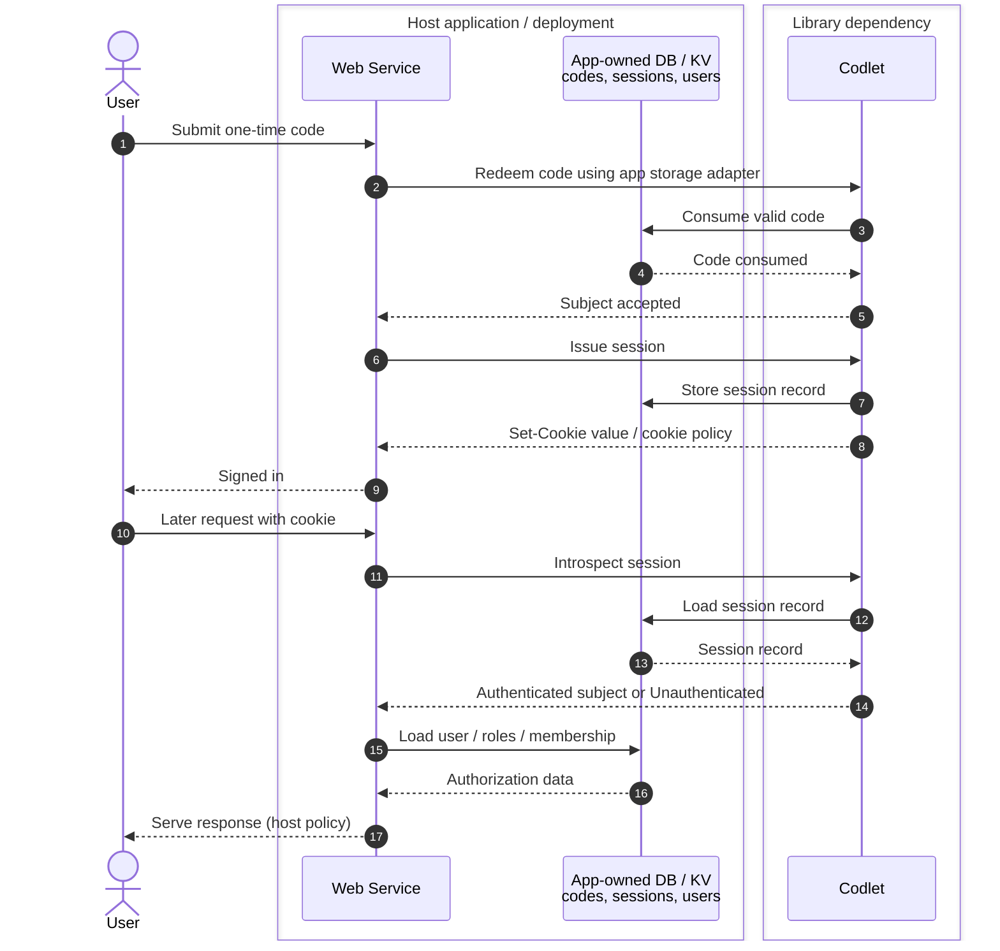

# codlet

[](https://crates.io/crates/codlet-core)
[](https://docs.rs/codlet-core)
[](https://deps.rs/crate/codlet-core)
[](LICENSE)

**Embedded one-time-code authentication primitives for Rust web services.**

## Overview

codlet lets a Rust web service exchange a short, human-friendly one-time code
for an application-defined subject and session — without passwords, email
verification, OAuth redirects, or a separately operated identity-provider
server. It is a library of auditable security primitives plus optional runtime
adapters, designed to be embedded directly in a single-service deployment.

codlet authenticates a subject. **The host application authorizes that
subject.** codlet has no concept of users, roles, permissions, communities, or
organizations, and never makes access-control decisions.

## Why / when

Use codlet when you want private, invite-only access for non-technical users
and want to keep operational complexity low: one service, one database, no
second auth server to run. It suits neighborhood groups, hobby clubs, small
team tools, event sign-ups, and similar invite-driven membership systems. It is
**not** an IdP, a user-management system, or an authorization framework, and it
does not try to make short codes look stronger than they are.

## Quick start

Add the core crate and your chosen adapter to `Cargo.toml`:

```toml
[dependencies]
codlet-core = "0.16"

# Cloudflare Workers (wasm32 target only):
[target.'cfg(target_arch = "wasm32")'.dependencies]
codlet-worker = "0.16"

# SQLite or PostgreSQL (native targets):
# codlet-sqlx = "0.16"
# codlet-sqlx = { version = "0.16", default-features = false, features = ["postgres"] }
```

The shape of the core primitives:

```rust
use codlet_core::{CodePolicy, SecretHasher, StaticKeyProvider, SecretDomain};
use codlet_core::{generate_code, validate_code_input};
use codlet_core::rng::SystemRandom;
use std::time::Duration;

// A policy: unambiguous alphabet, >=8 chars, 24h TTL.
let policy = CodePolicy::default_human(Duration::from_secs(24 * 3600)).unwrap();

// Generate a one-time code (fails closed if the RNG fails).
let mut rng = SystemRandom::new();
let code = generate_code(&policy, &mut rng).unwrap();

// Derive the value stored in the database: a domain-separated HMAC, never the
// plaintext. Real key material comes from a secret manager, not a literal.
let hasher = SecretHasher::new(
    StaticKeyProvider::single("v1", b"real-key-from-secret-manager".to_vec()).unwrap(),
);
let normalized = validate_code_input(code.expose(), &policy).unwrap();
let (lookup_key, key_version) = hasher.lookup_key(SecretDomain::Code, &normalized).unwrap();
assert_eq!(key_version.as_str(), "v1");
let _ = lookup_key; // store this + key_version; never store `code`
```

## Design notes

- **Security by default.** Secrets are stored only as keyed HMAC lookup values;
  missing key material and RNG failure both fail closed; redemption failures map
  to a single generic public error; session cookies are `HttpOnly; Secure;
  SameSite=Strict` by default.
- **Small, runtime-neutral core.** `codlet-core` carries no web-framework,
  database, or async-executor dependencies. Runtime support (Cloudflare
  Workers/D1/KV, SQLx, Axum) lives in separate adapter crates.
- **Storage proves its own atomicity.** One-time claim and single-use
  form-token consume are trait-level contracts backed by conditional writes;
  every adapter must pass a shared conformance suite.

## How it fits in your service

codlet authenticates — your application authorizes. The diagram below shows
where codlet's responsibility begins and ends; storage, users, roles, and
authorization decisions remain entirely with the host service.



## More detail

- Architecture, scope, and non-goals: [`rfcs/done/RFC-001`](./rfcs/done/RFC-001-project-scope-product-shape-non-goals.md),
  [`rfcs/done/RFC-002`](./rfcs/done/RFC-002-crate-architecture-feature-flags-runtime-matrix.md).
- All design proposals and their lifecycle: [`rfcs/README.md`](./rfcs/README.md).
- **Threat model** (what codlet protects against): [`docs/src/threat-model.md`](./docs/src/threat-model.md).
- **Adapter guarantee matrix** and secure configuration guide: [`docs/src/adapter-matrix-and-config.md`](./docs/src/adapter-matrix-and-config.md).
- **Key rotation** and emergency procedure: [`docs/src/key-rotation.md`](./docs/src/key-rotation.md).
- **Migration from an existing service**: [`docs/src/migration-from-an-existing-service.md`](./docs/src/migration-from-an-existing-service.md).
- Security policy and how to report a vulnerability: [`SECURITY.md`](./SECURITY.md).
- Full documentation lives under [`docs/src`](./docs/src) (mdBook-compatible).

## License

Licensed under the Apache License, Version 2.0. See [`LICENSE`](./LICENSE) and
[`NOTICE`](./NOTICE).
